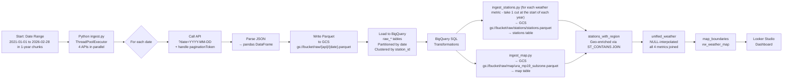

# Data Engineering Zoomcamp 2026 Project: Singapore Weather Data Pipeline and Dashboard (2021–2026)

---

## Problem Statement

Singapore is a tropical island city-state. It would be interesting to explore (1) how the available weather metrics (e.g. humidity, rainfall, wind speed, temperature) change over time, and (2) how the various geographic areas fare in terms of weather conditions. 

Given that now is March 2026, for the period of analysis, I will focus on the more recent years, from 2021 to 2026.

For the weather dataset available from data.gov.sg from 2021 to 2026, the data for each weather metric seems to be accessible only through APIs with pagination limits. Data is granular down to the minute level. The dataset is also granular at the weather station level, with stations situated in various parts of the island.

Data.gov.sg also offers a map dataset of the island at different level of granularity: (1) regions, (2) planning areas, and (3) subzones. As we drill down to the granular planning area and subzone levels, there are areas with no weather stations, or some weather stations might not capture certain weather metrics.


**Solution:**
1. Build a batch ingestion pipeline that:
   * Backfills 5+ years of historical data from APIs using date-range queries
   * Stores raw data in parquet format in a data lake (Google Cloud Storage)
   * Ingests raw data from Google Cloud Storage into Google BigQuery
2. Transform and enrich data using BigQuery SQL (separate weather metrics tables, unified weather metrics table, map and weather station geospatial tables, pre-aggregated geospatial and weather metrics tables/views for visualisation)
3. Looker Studio dashboard with map, tabular and time-series visualisations

---

## Architecture



---

## Dataset: Singapore Real-Time Weather APIs (data.gov.sg)

The dataset of choice was the 4 weather APIs from data.gov.sg. The API dataset was chosen for
* its granularity in both time (down to the minute or 5-minute intervals) and location (weather stations across the island)
* the availability of historical data from 2021-01-01 to 2026-02-28
* familiarising myself with ingesting data from API data sources, instead of ingesting data only from files

All 4 APIs share an identical request/response contract. Only the 'endpoint path' and 'measurement unit' differ.


### Common API Characteristics

| Aspect | Detail |
|---|---|
| **Base URL** | `https://api-open.data.gov.sg/v2/real-time/api` |
| **Method** | `GET` |
| **Auth** | Optional `x-api-key` header — used in this project for higher rate limits |
| **Date filter** | `?date=YYYY-MM-DD` (full day) or `?date=YYYY-MM-DDTHH:mm:ss` (point-in-time, SGT) |
| **If you do not provide a date filter** | Returns the **latest** reading only |
| **Pagination** | `paginationToken` query param; token only present when a next page exists |
| **Response structure** | `{ code, errorMsg, data: { stations[], readings[], readingType, readingUnit, paginationToken } }` |
| **Error codes** | `400` (bad date/token), `404` (data not found), `429` (rate limited) |

### Per-Endpoint Differences

| | Air Temperature | Rainfall | Relative Humidity | Wind Speed |
|---|---|---|---|---|
| **API Endpoint Path** | `/air-temperature` | `/rainfall` | `/relative-humidity` | `/wind-speed` |
| **Unit** | °C | mm | % | Knots |
| **Station location field** | `labelLocation` | `labelLocation` | `labelLocation` | `location` |
| **Example station** | S108 – Marina Gardens Drive | S111 – Scotts Road | S111 – Scotts Road | S117 – Banyan Road |
| **Reading type** | `DBT 1M F` (Dry-Bulb Temperature on a standard thermometer, measured at 1-minute intervals) | `TB1 Rainfall 5 Minute Total F` (Tipping-Bucket rain gauge measurements at 5-minute intervals) | `RH 1M F` (Relative Humidity measurements at 1-minute intervals) | `Wind Speed AVG(S)10M M1M` (Average wind speed [10 metres above ground](https://web.archive.org/web/20260324140406/https://www.mesonet.org/about/instruments/wind-measurements), measured at 1-minute intervals) |

> **Note:** Wind Speed uses `location` for station coordinates, while the other three use `labelLocation`. This is handled in `scripts/api_client.py` during parsing.


### Key Takeaways
1. **Identical contract** — all 4 APIs share the same request/response shape; only the `API endpoint path` and `unit` differ.
2. **Stations have coordinates** — each station provides lat/lng, enabling map-based geospatial joins.
3. **Readings are per-station** — each reading timestamp contains an array of `{ stationId, value }` pairs.
4. **Pagination may or may not appear** — `paginationToken` only appears in the response when a next page exists.

### API References
| API | Documentation | Endpoint |
|---|---|---|
| Air Temperature | [data.gov.sg](https://data.gov.sg/datasets/d_66b77726bbae1b33f218db60ff5861f0/view) | [/air-temperature](https://api-open.data.gov.sg/v2/real-time/api/air-temperature) |
| Relative Humidity | [data.gov.sg](https://data.gov.sg/datasets/d_2d3b0c4da128a9a59efca806441e1429/view) | [/relative-humidity](https://api-open.data.gov.sg/v2/real-time/api/relative-humidity) |
| Rainfall | [data.gov.sg](https://data.gov.sg/datasets/d_6580738cdd7db79374ed3152159fbd69/view) | [/rainfall](https://api-open.data.gov.sg/v2/real-time/api/rainfall) |
| Wind Speed | [data.gov.sg](https://data.gov.sg/datasets/d_7677738484067741bf3b56ab5d69c7e9/view) | [/wind-speed](https://api-open.data.gov.sg/v2/real-time/api/wind-speed) |

---

## Prerequisites

- GCP project with billing enabled
- data.gov.sg API key (sign up [here](https://data.gov.sg))
- Python 3.11
- Terraform v1.9+
- GitHub Codespace (recommended) or a Linux environment

---

## Quick Start

### Step 1: Clone the Repository

```bash
git clone https://github.com/KaiquanMah/sg-weather-2021-2026.git
cd sg-weather-2021-2026
```

### Step 2: Set Environment Variables

Create a `.env` file in the project root:

```bash
DATA_GOV_SG_API_KEY=your-api-key
GOOGLE_CLOUD_PROJECT=your-gcp-project-id
PROJECT_ID=your-gcp-project-id
REGION=asia-southeast1
BIGQUERY_DATASET_ID=weather_data
GCS_BUCKET_NAME=your-bucket-name   # update this again AFTER terraform apply
GOOGLE_APPLICATION_CREDENTIALS=/path/to/your-service-account.json
```

> ⚠️ After running `terraform apply`, update `GCS_BUCKET_NAME` in `.env` with the exact bucket name Terraform provisioned (it appends a random suffix for global uniqueness).

### Step 3: Install Dependencies

```bash
make install
# or
pip install -r requirements.txt
```

### Step 4: Install Terraform (GitHub Codespace)

```bash
TERRAFORM_VERSION="1.9.0"
curl -O "https://releases.hashicorp.com/terraform/${TERRAFORM_VERSION}/terraform_${TERRAFORM_VERSION}_linux_amd64.zip"
sudo apt-get install -y unzip
unzip -j "terraform_${TERRAFORM_VERSION}_linux_amd64.zip" terraform -d /tmp/
sudo mv /tmp/terraform /usr/local/bin/
sudo chmod +x /usr/local/bin/terraform
rm "terraform_${TERRAFORM_VERSION}_linux_amd64.zip"
terraform version
```

### Step 5: Provision Infrastructure with Terraform

```bash
make terraform-init
make terraform-plan
make terraform-apply
```

This provisions:
- A GCS bucket (with randomised suffix for global uniqueness)
- A BigQuery dataset (`weather_data`)
- 5 BigQuery tables: `raw_air_temperature`, `raw_rainfall`, `raw_relative_humidity`, `raw_wind_speed`, `unified_weather`

After apply, copy the bucket name from the Terraform output and update `GCS_BUCKET_NAME` in your `.env`.

---

## Step-by-Step Pipeline Guide

### Step 6: Run Unit Tests and Lint

```bash
make test
make lint
```

Tests use mocking to avoid actual API calls or cloud resource usage. See [Testing](#testing) for details.


### Step 7: Run the Full Ingestion (Jan 2021 – Feb 2026)

```bash
make run-ingestion
# which runs: python scripts/ingest.py
```

What happens under the hood:
- The script iterates over every calendar date in the configured date range.
- For each date, it launches **4 threads simultaneously** (`concurrent.futures.ThreadPoolExecutor`) — one per API endpoint.
- Each thread fetches data with full pagination support, parses the JSON into a pandas DataFrame, saves a `.parquet` file to GCS (`raw/{api}/{date}.parquet`), then loads it into the corresponding BigQuery raw table.
- Failures on one endpoint are caught by `try-except` and do **not** abort the other three endpoints for that date.
- All logs are written simultaneously to the terminal and to a yearly log file in `workings/workings-03b-ingest-API-weather-data-{year}.txt` for full traceability.

> **Test run:** Dec 2020 (5 days) was used to validate the pipeline end-to-end before the full run.
> **Full run:** Jan 2021 – Feb 2026 (~1,900 dates × 4 APIs).

For a single date:
```bash
make run-single-date DATE=2024-01-15
```


### Step 8: Ingest URA Map Boundaries

To support geospatial visualisation:

1. Navigate to [URA Master Plan 2019 Subzone Boundary (No Sea)](https://data.gov.sg/datasets/d_8594ae9ff96d0c708bc2af633048edfb/view) on Data.gov.sg and download the **GeoJSON** file.
2. Rename it to `ura_mp19_subzone.geojson` and place it in the `scripts/` folder.
3. Run:
   ```bash
   python scripts/ingest_map.py
   ```

What happens:
- Parses the GeoJSON `FeatureCollection`
- Extracts property attributes (`SUBZONE_N`, `PLN_AREA_N`, `REGION_N`) into dedicated columns
- Converts coordinate geometry to JSON strings
- Writes a `.parquet` file to GCS under a `map/` directory
- Loads into a `weather_data.map` BigQuery table


### Step 9: Ingest Station Lat-Lon Metadata

```bash
python scripts/ingest_stations.py
```

This script pings a 1 day slice from each of the years 2021, 2022, 2023, 2024, 2025 and 2026, across all 4 APIs to capture every station. A 1-day slice per year might be sufficient to efficiently capture every station, as the station list is not expected to change that frequently. Also, getting a 1 day slice of stations per year is better than just pinging for a 1-day slice in 2025 only, which might exclude any station that could have been commissioned.

After getting the station data, we drop duplicates, and load them into a `weather_data.stations` BigQuery table. This creates a **Dimension Table** for station names, latitudes, and longitudes — avoiding the need to re-ingest 5 years of Parquet files.


### Step 10: Ingest Station Lat-Lon Metadata AND BigQuery Data Transformations

We use a Dimension Table to append Station names, latitudes, and longitudes to the historical data, rather than re-ingesting 5 years of parquet files.

1. **Execute the Ingestion**:
   ```bash
   python scripts/ingest_stations.py
   ```
   *This script pings 1 day from 2021, 2022, 2023, 2024, 2025, and 2026 across all 4 APIs to capture every station (even decommissioned ones), drops duplicates, and loads them into a `weather_data.stations` BigQuery table.*

2. **Create or Update the Relevant BigQuery Tables to Prepare for Analysis**:
   
   ```sql
   -- 1. Drop the table (since it is empty anyway)
   DROP TABLE IF EXISTS `proud-outrider-483901-c3.weather_data.unified_weather`;

   -- 2. Recreate with original descriptions/labels/constraints, minus reading_type field (eg temp/rainfall/humidity/wind_speed), then add station_name/lat/lon
   CREATE TABLE `proud-outrider-483901-c3.weather_data.unified_weather`
   (
   reading_timestamp TIMESTAMP NOT NULL OPTIONS(description="Reading timestamp in SGT"),
   station_id STRING NOT NULL OPTIONS(description="Weather station ID"),
   station_name STRING OPTIONS(description="Name of the weather station"),
   latitude FLOAT64 OPTIONS(description="Station latitude"),
   longitude FLOAT64 OPTIONS(description="Station longitude"),
   temperature FLOAT64 OPTIONS(description="Air temperature in Celsius"),
   humidity FLOAT64 OPTIONS(description="Relative humidity percentage"),
   rainfall FLOAT64 OPTIONS(description="Rainfall amount in mm"),
   wind_speed FLOAT64 OPTIONS(description="Wind speed in knots"),
   ingest_timestamp TIMESTAMP OPTIONS(description="Timestamp when data was ingested")
   )
   PARTITION BY DATE(reading_timestamp)
   CLUSTER BY station_id 
   OPTIONS(
   labels=[("source", "data-gov-sg"), ("type", "analytics")]
   );


   -- 3. Add cols to
   -- convert lat-lon to coordinates with GEOGRAPHY DATATYPE
   -- then bring in from the 'map' - region/plannning_area/subzone names
   ALTER TABLE `proud-outrider-483901-c3.weather_data.unified_weather`
   ADD COLUMN coordinate GEOGRAPHY OPTIONS(description="Station lat/lon as GEOGRAPHY point"),
   ADD COLUMN region_name STRING OPTIONS(description="URA region name"),
   ADD COLUMN planning_area_name STRING OPTIONS(description="URA planning area name"),
   ADD COLUMN subzone_name STRING OPTIONS(description="URA subzone name"),
   ADD COLUMN station_name STRING OPTIONS(description="Station Road Name");
   ADD COLUMN latitude STRING OPTIONS(description="latitude"),
   ADD COLUMN longitude STRING OPTIONS(description="longitude");


   -- Query error: ALTER TABLE ALTER COLUMN SET DATA TYPE requires that the existing column type (STRING) is assignable to the new type (FLOAT64) at [39:1]
   -- so to fix the error below
   --   Drop the STRING columns
   --   Re-add as FLOAT64
   ALTER TABLE `proud-outrider-483901-c3.weather_data.unified_weather`
   ALTER COLUMN latitude SET DATA TYPE FLOAT64,
   ALTER COLUMN latitude SET OPTIONS(description="Station latitude");

   ALTER TABLE `proud-outrider-483901-c3.weather_data.unified_weather`
   ALTER COLUMN longitude SET DATA TYPE FLOAT64,
   ALTER COLUMN longitude SET OPTIONS(description="Station longitude");


   -- Drop the STRING columns
   ALTER TABLE `proud-outrider-483901-c3.weather_data.unified_weather`
   DROP COLUMN latitude;

   ALTER TABLE `proud-outrider-483901-c3.weather_data.unified_weather`
   DROP COLUMN longitude;

   -- Re-add as FLOAT64
   ALTER TABLE `proud-outrider-483901-c3.weather_data.unified_weather`
   ADD COLUMN latitude FLOAT64 OPTIONS(description="Station latitude"),
   ADD COLUMN longitude FLOAT64 OPTIONS(description="Station longitude");


   -- 4. Check data type of 'geometry' field - STRING or GEOGRAPHY
   --    it was STRING
   SELECT column_name, data_type
   FROM `proud-outrider-483901-c3.weather_data.INFORMATION_SCHEMA.COLUMNS`
   WHERE table_name = 'map' AND column_name = 'geometry';


   -- 5. Create 'stations_with_region' table
   CREATE OR REPLACE TABLE `proud-outrider-483901-c3.weather_data.stations_with_region` AS
   SELECT
   s.station_id,
   s.name,
   s.latitude,
   s.longitude,
   ST_GEOGPOINT(s.longitude, s.latitude)   AS coordinate,
   m.REGION_N                               AS region_name,
   m.PLN_AREA_N                             AS planning_area_name,
   m.SUBZONE_N                              AS subzone_name
   FROM `proud-outrider-483901-c3.weather_data.stations` s
   LEFT JOIN `proud-outrider-483901-c3.weather_data.map` m
   ON ST_CONTAINS(
      -- ══ Pick ONE of these based on your geometry column type ══
      -- Option 1 If geometry is STRING (GeoJSON):
      --    If the named argument make_valid is set to TRUE, the function attempts to repair polygons that don't conform to Open Geospatial Consortium semantics.
      ST_GEOGFROMGEOJSON(m.geometry, make_valid => TRUE),
      -- Option 2 If geometry is already GEOGRAPHY:
      -- m.geometry,

      -- then keep this whether we have 
      -- (1) STRING input 
      -- or (2) GEOGRAPHY input above for the GeoJSON's Polygon
      ST_GEOGPOINT(s.longitude, s.latitude)
   );


   -- 6. Fill NA region/planning area/subzone name for
   --    East Coast Parkway
   UPDATE `proud-outrider-483901-c3.weather_data.stations_with_region`
   SET region_name = 'EAST REGION', 
       planning_area_name = 'EAST COAST',
       subzone_name = 'EAST COAST'
   WHERE	station_id ='S107';


   -- 7. Insert the Data (Keeping NULLs, then interpolating NULL temperature/humidity/rainfall/wind_speed measures)
   DECLARE ingest_ts TIMESTAMP DEFAULT CURRENT_TIMESTAMP();

   INSERT INTO `proud-outrider-483901-c3.weather_data.unified_weather` (
   reading_timestamp,
   station_id,
   station_name,
   latitude,
   longitude,
   temperature,
   humidity,
   rainfall,
   wind_speed,
   ingest_timestamp,
   coordinate,
   region_name,
   planning_area_name,
   subzone_name
   )

   WITH spine AS (
   -- Step 1: Create the master timeline for all stations
   SELECT timestamp, station_id 
   FROM `proud-outrider-483901-c3.weather_data.raw_air_temperature`

   UNION DISTINCT

   SELECT timestamp, station_id 
   FROM `proud-outrider-483901-c3.weather_data.raw_rainfall`

   UNION DISTINCT

   SELECT timestamp, station_id 
   FROM `proud-outrider-483901-c3.weather_data.raw_relative_humidity`

   UNION DISTINCT

   SELECT timestamp, station_id 
   FROM `proud-outrider-483901-c3.weather_data.raw_wind_speed`
   ),

   raw_joined AS (
   -- Step 2: Join the raw data and the new enriched station geo-data
   SELECT
      s.timestamp AS reading_timestamp,
      s.station_id,
      st.name AS station_name,
      st.latitude,
      st.longitude,
      st.coordinate,
      st.region_name,
      st.planning_area_name,
      st.subzone_name,
      t.temperature,
      h.humidity,
      r.rainfall,
      w.speed AS wind_speed
   FROM spine s
   LEFT JOIN `proud-outrider-483901-c3.weather_data.stations_with_region` st
      ON s.station_id = st.station_id
   LEFT JOIN `proud-outrider-483901-c3.weather_data.raw_air_temperature` t
      ON s.timestamp = t.timestamp 
      AND s.station_id = t.station_id
   LEFT JOIN `proud-outrider-483901-c3.weather_data.raw_relative_humidity` h
      ON s.timestamp = h.timestamp 
      AND s.station_id = h.station_id
   LEFT JOIN `proud-outrider-483901-c3.weather_data.raw_rainfall` r
      ON s.timestamp = r.timestamp 
      AND s.station_id = r.station_id
   LEFT JOIN `proud-outrider-483901-c3.weather_data.raw_wind_speed` w
      ON s.timestamp = w.timestamp 
      AND s.station_id = w.station_id
   ),

   with_neighbors AS (
   -- Step 3: Find the nearest valid past and future values for each metric
   SELECT
      *,
      
      -- Temperature Neighbors
      LAST_VALUE(temperature IGNORE NULLS) OVER w_prev AS prev_temp,
      FIRST_VALUE(temperature IGNORE NULLS) OVER w_next AS next_temp,
      
      -- Humidity Neighbors
      LAST_VALUE(humidity IGNORE NULLS) OVER w_prev AS prev_hum,
      FIRST_VALUE(humidity IGNORE NULLS) OVER w_next AS next_hum,
      
      -- Rainfall Neighbors
      LAST_VALUE(rainfall IGNORE NULLS) OVER w_prev AS prev_rain,
      FIRST_VALUE(rainfall IGNORE NULLS) OVER w_next AS next_rain,
      
      -- Wind Speed Neighbors
      LAST_VALUE(wind_speed IGNORE NULLS) OVER w_prev AS prev_wind,
      FIRST_VALUE(wind_speed IGNORE NULLS) OVER w_next AS next_wind

   FROM raw_joined
   WINDOW 
      -- Looks at everything before the current row
      w_prev AS (PARTITION BY station_id ORDER BY reading_timestamp ROWS BETWEEN UNBOUNDED PRECEDING AND 1 PRECEDING),
      -- Looks at everything after the current row
      w_next AS (PARTITION BY station_id ORDER BY reading_timestamp ROWS BETWEEN 1 FOLLOWING AND UNBOUNDED FOLLOWING)
   )
   -- Step 4: Calculate the final interpolated values and Insert
   SELECT
   reading_timestamp,
   station_id,
   station_name,
   latitude,
   longitude,
   
   -- The FillNA Logic: COALESCE stops at the first NON-NULL value it finds.
   -- 1. Use actual | 2. Use Average | 3. Use Prev (if no next) | 4. Use Next (if no prev)
   COALESCE(temperature, (prev_temp + next_temp) / 2.0, prev_temp, next_temp) AS temperature,
   COALESCE(humidity,    (prev_hum + next_hum) / 2.0,   prev_hum,  next_hum)  AS humidity,
   COALESCE(rainfall,    (prev_rain + next_rain) / 2.0, prev_rain, next_rain) AS rainfall,
   COALESCE(wind_speed,  (prev_wind + next_wind) / 2.0, prev_wind, next_wind) AS wind_speed,
   
   -- Inject the declared variable here
   ingest_ts AS ingest_timestamp,
   
   -- Appended spatial fields
   coordinate,
   region_name,
   planning_area_name,
   subzone_name

   FROM with_neighbors;


   -- 8. Create table with geometry at different levels of map-drilldown
   --    Region
   --    Planning Area
   --    Subzone
   CREATE OR REPLACE TABLE `proud-outrider-483901-c3.weather_data.map_boundaries` AS
   -- Level 1: Region (5 rows — coarsest)
   SELECT
   'region'          AS geo_level,
   REGION_N          AS region_name,
   CAST(NULL AS STRING) AS planning_area_name,
   CAST(NULL AS STRING) AS subzone_name,
   ST_UNION_AGG(
      ST_GEOGFROMGEOJSON(geometry, make_valid => TRUE)
   )                 AS geo
   FROM `proud-outrider-483901-c3.weather_data.map`
   GROUP BY REGION_N

   UNION ALL

   -- Level 2: Planning Area (~55 rows)
   SELECT
   'planning_area'   AS geo_level,
   REGION_N          AS region_name,
   PLN_AREA_N        AS planning_area_name,
   CAST(NULL AS STRING) AS subzone_name,
   ST_UNION_AGG(
      ST_GEOGFROMGEOJSON(geometry, make_valid => TRUE)
   )                 AS geo
   FROM `proud-outrider-483901-c3.weather_data.map`
   GROUP BY REGION_N, PLN_AREA_N

   UNION ALL

   -- Level 3: Subzone (~300+ rows — finest)
   SELECT
   'subzone'         AS geo_level,
   REGION_N          AS region_name,
   PLN_AREA_N        AS planning_area_name,
   SUBZONE_N         AS subzone_name,
   ST_GEOGFROMGEOJSON(geometry, make_valid => TRUE) AS geo  -- no aggregation needed
   FROM `proud-outrider-483901-c3.weather_data.map`;


   -- 9. Consolidated map view with aggregated metrics
   CREATE OR REPLACE VIEW `proud-outrider-483901-c3.weather_data.vw_weather_map` AS
   WITH daily_metrics AS (
   SELECT
      DATE(reading_timestamp) AS reading_date,
      region_name,
      planning_area_name,
      subzone_name,
      AVG(temperature)          AS avg_temperature,
      AVG(humidity)             AS avg_humidity,
      AVG(rainfall)             AS avg_rainfall,
      AVG(wind_speed)           AS avg_wind_speed,
      COUNT(DISTINCT station_id) AS station_count
   FROM `proud-outrider-483901-c3.weather_data.unified_weather`
   WHERE region_name IS NOT NULL
   GROUP BY reading_date, region_name, planning_area_name, subzone_name
   )

   -- Region level
   SELECT
   'region'              AS geo_level,
   d.reading_date,
   d.region_name,
   CAST(NULL AS STRING)  AS planning_area_name,
   CAST(NULL AS STRING)  AS subzone_name,
   AVG(d.avg_temperature)  AS avg_temperature,
   AVG(d.avg_humidity)     AS avg_humidity,
   AVG(d.avg_rainfall)     AS avg_rainfall,
   AVG(d.avg_wind_speed)   AS avg_wind_speed,
   SUM(d.station_count)    AS station_count,
   -- Bigquery - Grouping by expressions of type GEOGRAPHY is not allowed
   ANY_VALUE(map.geo)      AS geo
   FROM daily_metrics d
   JOIN `proud-outrider-483901-c3.weather_data.map_boundaries` map
   ON  map.geo_level = 'region'
   AND map.region_name = d.region_name
   GROUP BY d.reading_date, d.region_name

   UNION ALL

   -- Planning area level
   SELECT
   'planning_area'       AS geo_level,
   d.reading_date,
   d.region_name,
   d.planning_area_name,
   CAST(NULL AS STRING)  AS subzone_name,
   AVG(d.avg_temperature)  AS avg_temperature,
   AVG(d.avg_humidity)     AS avg_humidity,
   AVG(d.avg_rainfall)     AS avg_rainfall,
   AVG(d.avg_wind_speed)   AS avg_wind_speed,
   SUM(d.station_count)    AS station_count,
   -- Bigquery - Grouping by expressions of type GEOGRAPHY is not allowed
   ANY_VALUE(map.geo)      AS geo
   FROM daily_metrics d
   JOIN `proud-outrider-483901-c3.weather_data.map_boundaries` map
   ON  map.geo_level = 'planning_area'
   AND map.region_name = d.region_name
   AND map.planning_area_name = d.planning_area_name
   GROUP BY d.reading_date, d.region_name, d.planning_area_name

   UNION ALL

   -- Subzone level
   SELECT
   'subzone'             AS geo_level,
   d.reading_date,
   d.region_name,
   d.planning_area_name,
   d.subzone_name,
   d.avg_temperature,
   d.avg_humidity,
   d.avg_rainfall,
   d.avg_wind_speed,
   d.station_count,
   -- no aggregation needed for 'geo'
   map.geo
   FROM daily_metrics d
   JOIN `proud-outrider-483901-c3.weather_data.map_boundaries` map
   ON  map.geo_level = 'subzone'
   AND map.region_name = d.region_name
   AND map.planning_area_name = d.planning_area_name
   AND map.subzone_name = d.subzone_name;
   ```

---

## Data Model

### BigQuery Tables

| Table | Description | Partitioned By | Clustered By |
|---|---|---|---|
| `raw_air_temperature` | Raw temperature readings | `timestamp` (DAY-level) | `station_id` |
| `raw_rainfall` | Raw rainfall readings | `timestamp` (DAY-level) | `station_id` |
| `raw_relative_humidity` | Raw humidity readings | `timestamp` (DAY-level) | `station_id` |
| `raw_wind_speed` | Raw wind speed readings | `timestamp` (DAY-level) | `station_id` |
| `stations` | Station dimension table (id, name, lat, lon) | — | — |
| `map` | URA subzone GeoJSON polygons | — | — |
| `stations_with_region` | Stations enriched with URA region/planning area/subzone via `ST_CONTAINS` | — | — |
| `unified_weather` | All 4 metrics joined, NULLs interpolated, geo-enriched | `reading_timestamp` (DAY-level) | `station_id` |
| `map_boundaries` | Pre-aggregated polygons at region/planning area/subzone levels | — | — |
| `vw_weather_map` | View: daily metrics aggregated by geo level, joined to boundaries for Looker dashboard | — | — |

**Why partition and cluster?**
- **Partitioning by date** means queries filtered to a specific date or range only need to scan the relevant partition, which significantly reduces data processed and cost
- **Clustering by `station_id`** means that within each `date` partition, rows for the same `station` are stored together. Queries filtering or grouping by `station` avoid scanning irrelevant rows.

---

## Dashboard

The Looker Studio dashboard provides visualisation of weather metrics at various geographc levels (region, planning area, subzone) and temporal levels (Monthly (in a year and across years), quarterly, day-of-week, day-of-month).

The dashboard includes:
- Geographic average temperature maps showing 3 different views: region, planning area, and subzone
- Table view of all 4 metrics at the region, planning area, and subzone levels
- Monthly (in a year and across years), quarterly, day-of-week/day-of-month trend charts for all 4 metrics

For more details on the insights gathered from the dashboard (such as the urban heating effect in Marina South, monsoon pattern analysis, and geographic area nuances), please refer to **[dashboard-description.md](./workings/looker-dashboard-screenshots/dashboard-description.md)**.

---

## Code Structure

```
scripts/
├── config.py           # Config settings (API endpoints, GCP settings, rate limits)
├── api_client.py       # API requests with retry logic, pagination, parallelisation
├── ingest.py           # Main orchestrator — iterates dates, calls all 4 APIs in parallel
├── ingest_map.py       # Standalone script for URA GeoJSON map ingestion
├── ingest_stations.py  # Standalone script for station dimension table
└── loaders.py          # GCS and BigQuery data loading

tests/
├── test_api_client.py  # Unit tests for API client
└── test_loaders.py     # Unit tests for data loaders

terraform/
├── main.tf             # GCP infrastructure (BigQuery dataset/tables, GCS bucket)
├── variables.tf        # Input variables
└── outputs.tf          # Output values (e.g. bucket name)

dbt/                    # dbt project (evaluated, not used in final pipeline — see below)
kestra/                 # Kestra workflow (evaluated, not used in final pipeline — see below)

workings/               # Full working logs, SQL workings, API specs, dashboard screenshots
```

---

## Testing

```bash
make test   # run all tests
make lint   # lint code
```

### Test Suite

#### `test_api_client.py`
- `test_make_request_success` — successful 200 response handling
- `test_make_request_429_retry` — rate limiting and retry logic
- `test_make_request_404_empty_response` — graceful empty response handling
- `test_fetch_data_for_date_formatting` — date formatting for API calls
- `test_fetch_all_data_for_date_calls_all_endpoints` — all 4 endpoints called per date

#### `test_loaders.py`
- `test_save_to_gcs` — Parquet serialisation and GCS upload
- `test_load_to_bigquery` — BigQuery schema mapping and loading
- `test_transform_data_*` (4 methods) — transformation logic per weather type
- `test_load_weather_data_calls_correct_tables` — correct table routing per endpoint

All tests use mocking for GCP services — no actual cloud resources required.

---

## CI/CD

GitHub Actions run on every `git push`:
- **Tests:** pytest on Python 3.11
- **Lint:** code style checks
- **Terraform validation:** checks HCL syntax and formatting

---

## Troubleshooting

### `string index out of range` / `.env` not loaded
`config.py` manually parses the `.env` file at runtime using native Python (no `python-dotenv` needed). Ensure your `.env` is in the project root and `PROJECT_ID` is set correctly.

### `404 The specified bucket does not exist`
Terraform appends a random suffix to the bucket name for global uniqueness. After `terraform apply`, copy the exact bucket name from the output and update `GCS_BUCKET_NAME` in your `.env`.

### `404 Not Found: Dataset ...`
Ensure `BIGQUERY_DATASET_ID=weather_data` in your `.env` matches the dataset Terraform provisioned.

### PyArrow Timestamp Errors
`ingest_timestamp` is explicitly cast with `pd.to_datetime()` and timezone-aware (`Asia/Singapore`, `+08:00`) before BigQuery loading. Ensure you are using the latest `requirements.txt`.

### API Rate Limiting (HTTP 429)
The client retries with exponential backoff automatically. If HTTP 429 errors are persistent, increase `REQUEST_DELAY` in `config.py`.

### GCP Authentication Errors
```bash
gcloud auth application-default login
gcloud auth application-default print-access-token
```

### Terraform State Issues
```bash
cd terraform && terraform refresh
```

---

## What We Tried and Dropped

### dbt (Dropped)

dbt was initially planned to be used for SQL transformations (see `dbt/` folder). After evaluation, it was dropped for these reasons:
- **Complex scope:** Setting up dbt models, sources, profiles, and the dbt Cloud/CLI integration added significant overhead for a project where the transformation logic could be expressed in a clean way using BigQuery SQL.
- **Time constraints:** The learning curve and configuration effort for dbt were not justified given a constrained project deadline.
- **Equivalent result:** BigQuery SQL (`CREATE TABLE ... AS SELECT`, `INSERT INTO ... WITH ...`, window functions, `ST_CONTAINS`) achieved the same transformation goals directly with full control over partitioning, clustering, and NULL interpolation. The `dbt/` folder and all its files remain in the repository as evidence of the work done.

### Kestra (Tried Then Dropped)

Kestra was deployed via Docker Compose and used to orchestrate ingestion for Jan–Feb 2025 as a proof of concept (see `kestra/weather_pipeline.yaml` and the Kestra screenshots in `workings/`). It was subsequently dropped for two key reasons:

1. **Slow startup:** The Docker-based Kestra environment took a considerable amount of time to initialise for each run, i.e. the cold start problem.
2. **Truncated logs:** Kestra's UI truncated large portions of log output from long-running tasks. For a iterative 1-year historical backfills, this made it impossible to verify which dates were successfully ingested and which dates had errors, which would make debugging painful. Python's logging in the terminal and `.txt` files in the `workings/` directory gave me full, non-truncated, searchable records for every single date, which was important for traceability and debugging.

The `kestra/` folder and all its files remain in the repository as evidence of the work done.


---

## License

© 2026 Kaiquan Mah. All rights reserved.

This source code is made available for viewing and reference purposes only.
No permission is granted to copy, modify, distribute, or use this code
in any form without prior written consent from the author.

---

## Acknowledgments

- Data sourced from [data.gov.sg](https://data.gov.sg)
- Data engineering project done as part of the [Data Engineering Zoomcamp 2026](https://github.com/DataTalksClub/data-engineering-zoomcamp)
